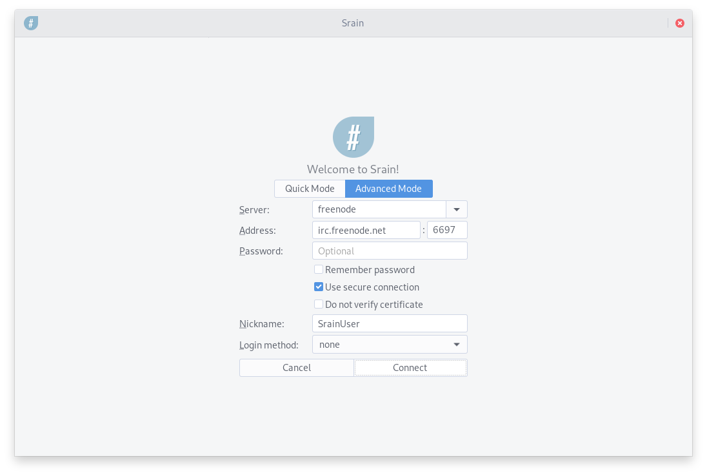
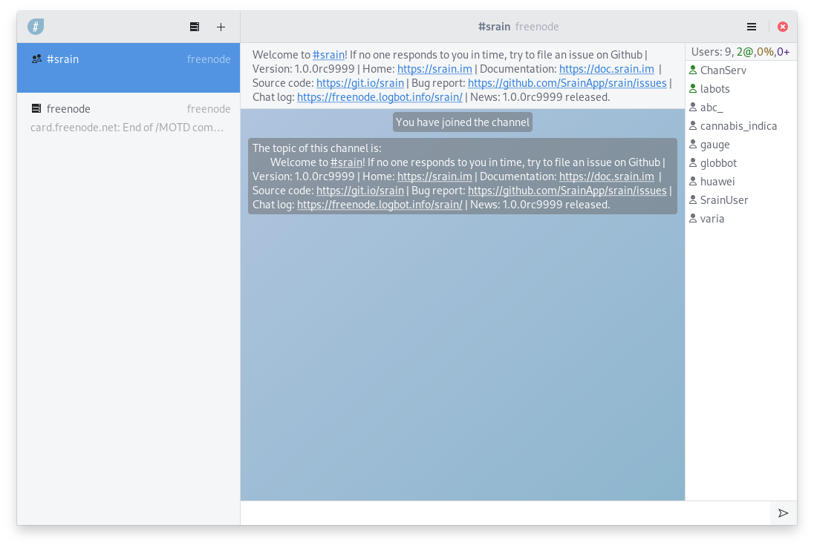
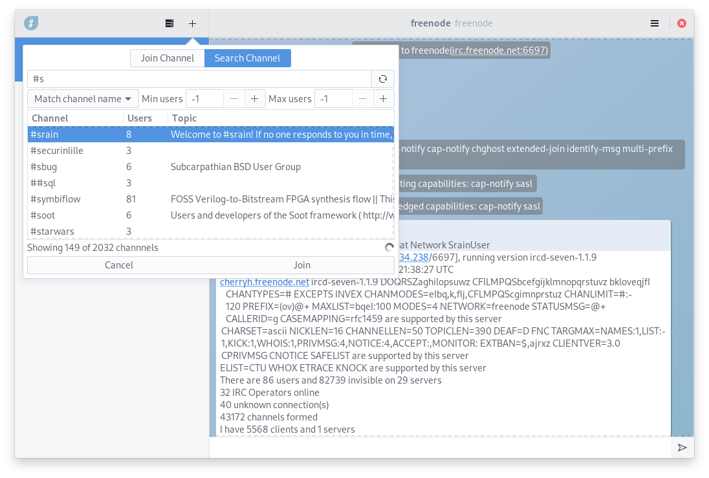

===========
Quick Start
===========

.. contents::
    :local:
    :depth: 3
    :backlinks: none

.. note::

    For your information, the following screenshots are taken under
    GNOME 3.34.4 with Wayland backed with `Arc GTK theme`_ and
    `Breeze icon theme`_.

.. _Arc gtk theme: https://github.com/arc-design/arc-theme
.. _Breeze icon theme: https://github.com/KDE/breeze-icons

Start Srain
===========

After the :doc:`install` of Srain, you will find Srain in your
applications list, if not, just type ``srain`` in your shell to run it. Then you
will see Srain's initial interface.

.. figure:: _static/srain-startup.png

Connect to IRC server
=====================

`freenode`_ is a famous IRC network, the official channel of Srain `#srain`_ is
also hosted on it. Let's start by connecting to freenode.

.. _freenode: https://freenode.net/

Predefined Server
~~~~~~~~~~~~~~~~~

Srain has a predefined list of commonly used IRC servers,
freenode is one of it. If you want to add server into this list, refer to
:doc:`config`.

Click the connection button on the Srain header bar, select the page "Quick Mode",
select the item "freenode" from candidate box with label "Server",
enter your nickname, then click the "Connect" button:

.. figure:: _static/srain-connect-predefined-server.png

If everything goes well, Srain should connected to freenode, then your would see
some message from freenode's server:

.. figure:: _static/srain-connected-server.png

Custom Server
~~~~~~~~~~~~~

While the server your want to connect to is not listed in the predefined list,
switch to the page "Advanced Mode", enter the hostname, port, and etc.

.. note::

    - If the port is a TLS port, make sure that the option
      "Use secure connection" is checked.
    - If the server's certificate is untrusted and you insist on continuing,
      check the option "Do not verify certificate".

Then click the "Connect" button:

Using Command
~~~~~~~~~~~~~

Refer to :ref:`commands-server` and :ref:`commands-connect`.

If you want to automatically execute commands at each time Srain starts, please
refer to :ref:`commands-playground`.

Join Channel
============

After connecting to freenode, now let's try to join `#srain`_, the official
channel of Srain.

.. _#srain: ircs://chat.freenode.org:6697/srain

Directly Join
~~~~~~~~~~~~~

While your has a clear channel to join, such as `#srain`_, just click the join
button, select the page "Join Channel", enter the channel name in the input
entry with label "Channel", then click the "Join" button:

.. figure:: _static/srain-join-channel.png

Now you should joined the channel:

Search Channel
~~~~~~~~~~~~~~

While you don't know the exact name of the channel, click the join button,
switch to page "Search Channel", click the button with "refresh" icon, Srain
should start receiving channel list from server.

Then you can enter the keyword or specify the filter conditions to search
channel. For example we enter "#s", select the channel you want to join from
channe list, then click "Join" button to join it.

.. note::

    If the channel requires a join password, try double click the row
    of channel.

Using Command
~~~~~~~~~~~~~

Refer to :ref:`commands-join`.
